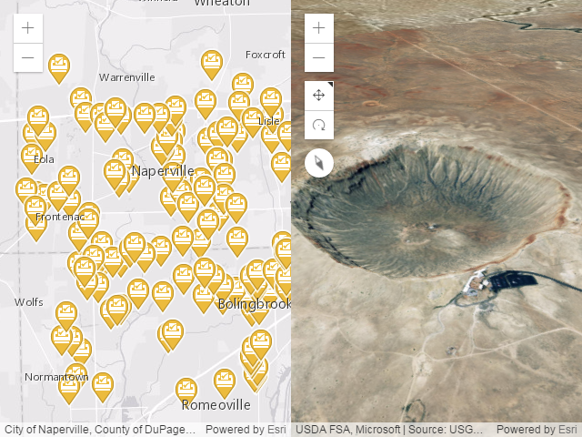

# configurable-app-examples-js: maps-and-scenes

*[Configurable Application Examples](https://github.com/Esri/configurable-app-examples-4x-js) using the arcgis-boilerplate-js*

The maps-and-scenes example application illustrates how the [Esri application boilerplate](https://github.com/Esri/application-boilerplate-4x-js) can be modified to show webmaps and/or webscenes. See that repository for information about deploying applications based on the Esri application boilerplate.

*Created using URL parameters webmap=082122d449ce427cab9baab377fc05df&webscene=91b46c2b162c48dba264b2190e1dbcff*

## Features

### Description of changes from the Esri application boilerplate

* application\Application.ts: replaced
* application\nls\resources.js: replaced
* styles\application.scss: added style `.configurable-application--message`
* Gruntfile.js: SASS output style changed from `compressed` to `nested` to make styles\application.css more readable in case this example will be customized without SASS

### URL parameters

The application boilerplate supports a rich set of URL parameters to override the website configuration. The maps-and-scenes example can be used to illustrate some of them. In the following table, just replace `yourWebsite` with the website that you set up for this example.

|parameter|description|example|
|---|---|---|
|basemapUrl|Specify the basemap to use for the webmap(s) (ignored by webscenes)|http://yourWebsite/?webmap=1998592ad23a4b4ca239e7c7cdc4e4b9&basemapUrl=https://services.arcgisonline.com/ArcGIS/rest/services/World_Imagery/MapServer|
|basemapUrl & basemapReferenceUrl|Specify the basemap and overlying basemap reference layer to use for the webmap (ignored by webscenes)|http://yourWebsite/?webmap=1998592ad23a4b4ca239e7c7cdc4e4b9&basemapUrl=https://services.arcgisonline.com/ArcGIS/rest/services/World_Imagery/MapServer&basemapReferenceUrl=http://services.arcgisonline.com/ArcGIS/rest/services/Reference/World_Boundaries_and_Places/MapServer|
|center|Start the webmap(s) at the specified longitude, latitude, and zoom level|http://yourWebsite/?webmap=1998592ad23a4b4ca239e7c7cdc4e4b9&center=-13044705.25;4036227.41;102113&level=12|
|extent|Start the webmap(s) at the specified longitude and latitude extents|http://yourWebsite/?webmap=1998592ad23a4b4ca239e7c7cdc4e4b9&extent=-76.2,38.5,-75.3,38.1|
|find|Seek the specified feature and position the webmap(s) at the feature if found|http://yourWebsite/?webmap=1998592ad23a4b4ca239e7c7cdc4e4b9&webscene=91b46c2b162c48dba264b2190e1dbcff&find=jackson%20wy|
|locale|Use the specified [ISO 639-1 locale code](https://www.loc.gov/standards/iso639-2/php/code_list.php) for the app display|http://yourWebsite/?webmap=1998592ad23a4b4ca239e7c7cdc4e4b9&locale=fr|
|marker|Start the webmap(s) at the specified longitude, latitude, and zoom level; place the specified graphic at that location; set the graphic's popup to use the specified title and content|http://yourWebsite/?webmap=1998592ad23a4b4ca239e7c7cdc4e4b9&marker=-117.1956564,34.0561513,4326,My%20Popup%20Title,http://webapps-cdn.esri.com/Apps/MegaMenu/img/mega-menu-search-btn.png,My%20popup%20content&level=10|
|webmap|One or more comma-separated webmap ids|http://yourWebsite/?webmap=082122d449ce427cab9baab377fc05df,1998592ad23a4b4ca239e7c7cdc4e4b9|
|webscene|One or more comma-separated webscene ids|http://yourWebsite/?webscene=91b46c2b162c48dba264b2190e1dbcff,a977542e41844703887e123d5fda148a|
|viewpoint|Set the camera viewpoint for the webscene(s) (ignored by webmaps)|http://yourWebsite/?webscene=91b46c2b162c48dba264b2190e1dbcff&viewpoint=cam:-110.85,43.5,3500;356,85|

#### Notes

The **webmap and webscene parameters** are interchangeable in this example application. The distinction is provided in the configuration for apps that might need it. Except for the `basemapUrl`, `basemapReferenceUrl`, and `viewpoint` parameters, `webmap` and `webscene` parameters are interchangeable.

If **both the webmap and webscene parameters are in the URL**, the maps-and-scenes example displays all of the webmaps first, then all of the webscenes. If you want to change this order, you can simply put all of the webmap and webscene ids into one of the parameters, e.g., http://yourWebsite/?webmap=1998592ad23a4b4ca239e7c7cdc4e4b9,91b46c2b162c48dba264b2190e1dbcff,e8f078ba0c1546b6a6e0727f877742a5,082122d449ce427cab9baab377fc05df

The **browser's locale** is used unless overridden by the locale URL parameter, above. Widgets and other display items provided by the Esri ArcGIS API for JavaScript are supported in [these languages](https://developers.arcgis.com/javascript/latest/guide/localization/). Text specific to this example is not translated.

The **camera viewpoint** consists of

* position: longitude, latitude, height *(Z-values defined in a geographic or metric coordinate system are expressed in meters. However, in local scenes that use a projected coordinate system, vertical units are assumed to be the same as the horizontal units specified by the service.)*
* heading in degrees clockwise from north
* tilt in degrees up from straight down at the surface

## Instructions

1. Fork and then clone the repo.
2. Run and try the sample.

## Requirements

* Notepad or your favorite HTML editor
* Web browser with access to the Internet

### TypeScript

The maps-and-scenes example application was written using [TypeScript](https://www.typescriptlang.org/) and [SASS](http://sass-lang.com/documentation/file.SASS_REFERENCE.html), but also includes the generated JavaScript and CSS in readable form.

If you choose to customize this example using these tools, we have provided the configuration files that we use for our development. Additional requirements are

* [Node.js](https://nodejs.org/en/)
* Node global packages
  * grunt
  * typescript
* Node development packages
  * @types/arcgis-js-api
  * dojo-typings
  * autoprefixer
  * npm-run-all
  * grunt
  * grunt-contrib-watch
  * grunt-postcss
  * grunt-sass
  * postcss-normalize-charset
  * typescript
  * tslint
  * grunt-tslint

## Resources

* [ArcGIS for JavaScript API Resource Center](http://help.arcgis.com/en/webapi/javascript/arcgis/index.html)
* [ArcGIS Blog](http://blogs.esri.com/esri/arcgis/)
* [twitter@esri](http://twitter.com/esri)

## Issues

Find a bug or want to request a new feature?  Please let us know by submitting an issue.

## Contributing

Esri welcomes contributions from anyone and everyone. Please see our [guidelines for contributing](https://github.com/esri/contributing).

## Licensing
Copyright 2017 Esri

Licensed under the Apache License, Version 2.0 (the "License");
you may not use this file except in compliance with the License.
You may obtain a copy of the License at

   http://www.apache.org/licenses/LICENSE-2.0

Unless required by applicable law or agreed to in writing, software
distributed under the License is distributed on an "AS IS" BASIS,
WITHOUT WARRANTIES OR CONDITIONS OF ANY KIND, either express or implied.
See the License for the specific language governing permissions and
limitations under the License.

A copy of the license is available in the repository's [license.txt]( https://raw.github.com/Esri/quickstart-map-js/master/license.txt) file.
